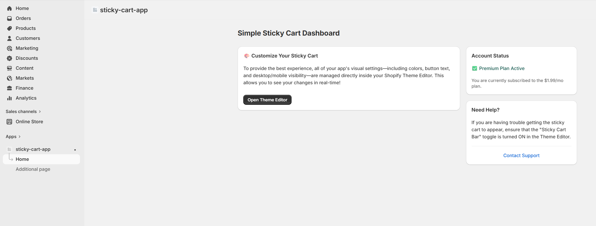
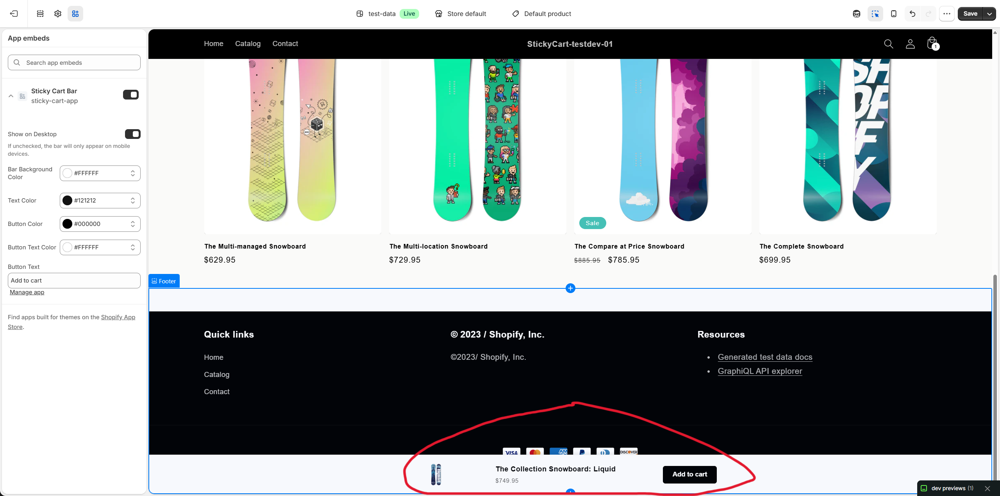
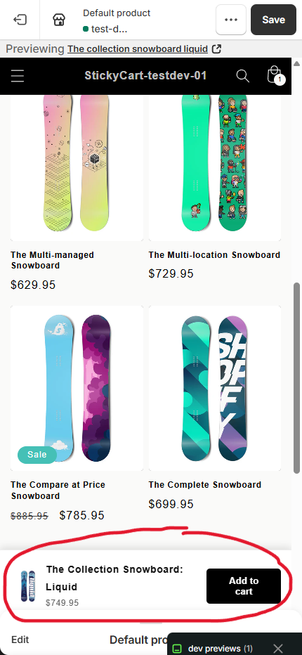
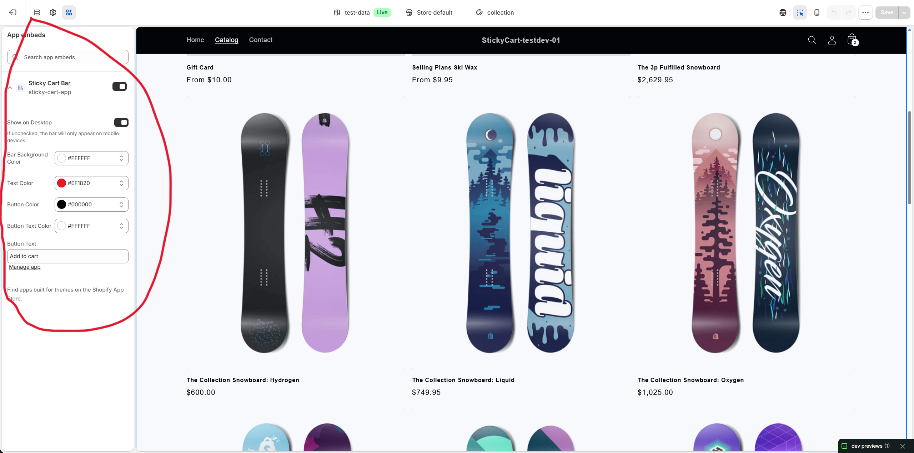

# Simple Sticky Cart - Shopify Utility App

A full-stack Shopify application designed to increase conversion rates by keeping the 'Add to Cart' button visible as users scroll through product pages.

## 📺 Video Walkthrough
https://github.com/user-attachments/assets/97dcbf5b-c73e-4f29-99ff-74d26678b7bf

## 📸 Screenshots
### Main Dashboard (Subscribed) View

### Desktop View

### Mobile View

### Settings View

## 🛠️ Tech Stack
- **Framework:** Remix & Node.js
- **Frontend:** React.js & Shopify Polaris
- **Database:** Neon (Serverless PostgreSQL) & Prisma ORM
- **Hosting:** Vercel
- **API:** Shopify Admin GraphQL API

## 💡 Key Features
- **Smart Sticky Logic:** Detects scroll depth to trigger the sticky bar.
- **Cross-Platform:** Optimized for both mobile and desktop views.
- **Zero-Latency:** Uses serverless database architecture for rapid response times.

---
*Note: The source code for this repository is private as it is a commercial product currently under monetization on the Shopify App Store. Technical walkthroughs are available upon request.*
